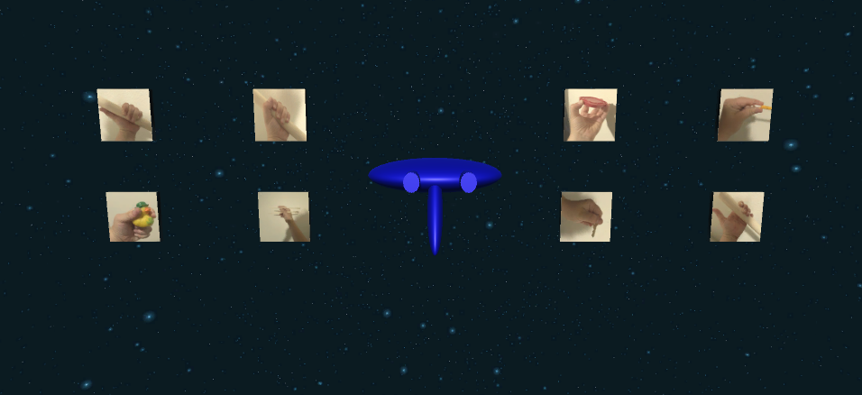
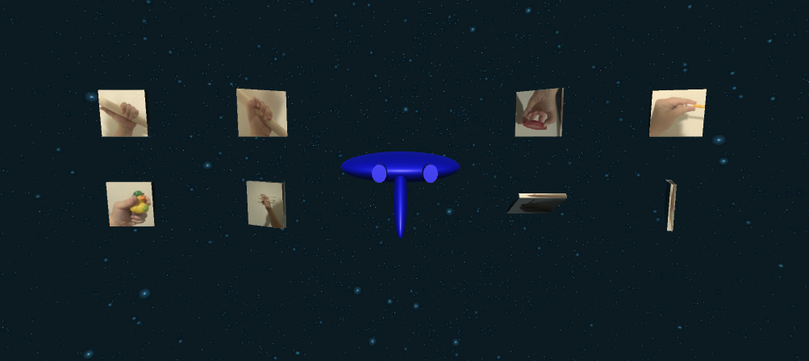
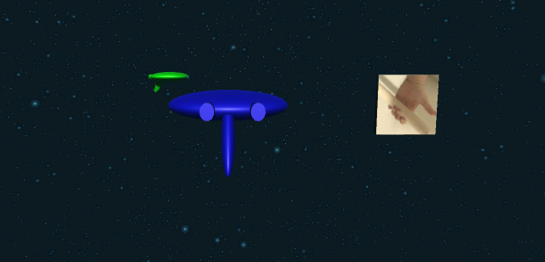

# BEAR Labs user study for prosthetic written by Mira Welner
Part of the difficulty in designing prosthetics for young children is that often times the young children are unwilling to sit still during a lengthy user study. To address this, I developed a video game for BEAR labs to make the process easier. This was part of a much larger project at BEAR labs, for which I played many roles, resulting in the following publication for which I am third co-author: https://pubmed.ncbi.nlm.nih.gov/36176073/.

The video game is designed so that a young child can wear a [Myoband](https://time.com/4173507/myo-armband-review/) and the signals will be sent to the game to control a rocket moving through space. The output consists of the actual movement compared to the movement the user was instructed to make.

The game is designed to be played with any type of myoelectric detection system - on this github you simply control the game by pressing keys which correlate to a specific motion. However the editing is fairly simple in unity so that you will easily be able to hook it up to a myoelectric detection system.

# How to connect your myoelectric detection system to the video game.
Game Development moves fast so alas this already runs on a non-latest version of Unity3d: Unity 2021.3.26f. However luckily if you use unityhub it isn't hard to get older versions of unity. But make sure you download the right version or the gamedev environment will break!

In rocket_behavior.cs, you will see at the top of the script it says:

```
KeyCode medium_wrap = KeyCode.Alpha1;
KeyCode power_sphere = KeyCode.Alpha2;
KeyCode precision_disk = KeyCode.Alpha3;
KeyCode prismatic_2_finger = KeyCode.Alpha4;
KeyCode lateral_tripod = KeyCode.Alpha5;
KeyCode tripod = KeyCode.Alpha6;
KeyCode lateral = KeyCode.Alpha7;
KeyCode light_tool = KeyCode.Alpha8;
```

All you have to do is change the values to PlayerInput (whichever device you are using). In the MyoBand the outputs were integers from 1 to 6, your detection system will likely be similar.

# How the data collection system works
The game starts out in the intro page: 

You click on the images of hand motions that you want included in the game - these were all hand motions included in the paper. When you click them they are a part of the game, and they start spinning:



Then the gameplay begins and enemies appear. The user makes the hand motion to defend against the enemy



Then the desired motion and the actual movement get logged in the `movements.txt` file, which is a CSV reporting the results

If you want to play 'as is' you can run the file for your operating system (macos, windows, or linux) which can be found in the executables folder. Keep in mind that the gameplay will be difficult because you will have to look at the image of a hand movement and remember which placeholder key to press. It becomes smooth once the myoelectric system has been integrated.
